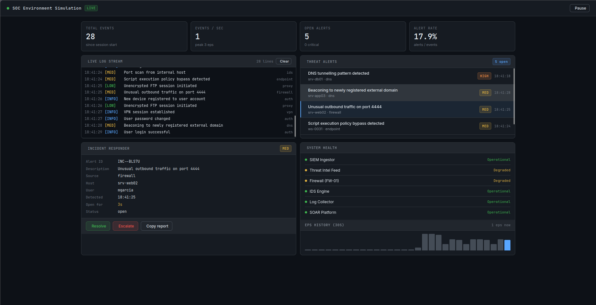

# SOC Environment Simulation

A simulated **Security Operations Center** dashboard for log analysis, threat detection, and incident response training.

Built with React + Vite. Runs anywhere via Docker.



---

## Features

- **Live log stream** — synthetic SIEM events emitted at realistic intervals, colour-coded by severity (CRIT / HIGH / MED / LOW / INFO)
- **Threat alert queue** — high-severity events are automatically promoted to alerts, sorted by priority
- **Incident responder** — click any alert to inspect host, user, source, and open time; resolve or escalate with one click; copy a formatted incident report to clipboard
- **System health board** — simulated status for SIEM, IDS, firewall, log collector, and SOAR platform
- **EPS sparkline** — rolling 30-second events-per-second history chart
- **Pause / resume** — freeze the stream at any time for training exercises

---

## Project structure

```
soc-environment-simulation/
├── src/
│   ├── components/
│   │   ├── Header.jsx         # Top bar with live indicator and controls
│   │   ├── StatCards.jsx      # KPI metric cards
│   │   ├── LogFeed.jsx        # Scrollable live log panel
│   │   ├── AlertList.jsx      # Sorted threat alert queue
│   │   ├── IncidentPanel.jsx  # Incident responder detail view
│   │   └── SystemHealth.jsx   # System status + EPS sparkline
│   ├── hooks/
│   │   ├── useLogEngine.js    # Drives synthetic log emission
│   │   ├── useAlerts.js       # Alert lifecycle and MTTD tracking
│   │   └── useSystemHealth.js # Randomised system health states
│   ├── data/
│   │   └── events.js          # Event catalogue and generators
│   ├── utils/
│   │   └── severity.js        # Severity helpers, formatters
│   ├── App.jsx                # Root component, wires engines together
│   ├── main.jsx               # React entry point
│   └── index.css              # Global dark-terminal stylesheet
├── Dockerfile                 # Multi-stage build (builder + nginx)
├── docker-compose.yml         # Production + dev profiles
├── nginx.conf                 # SPA routing + gzip config
├── vite.config.js
├── package.json
└── README.md
```

---

## Quick start

### Option 1 — Docker (recommended)

No Node.js required. Just Docker.

```bash
# Clone
git clone https://github.com/YOUR_USERNAME/soc-environment-simulation.git
cd soc-environment-simulation

# Build and run (production build served by nginx on port 8080)
docker compose up --build

# Open in browser
open http://localhost:8080
```

To stop:
```bash
docker compose down
```

---

### Option 2 — Docker dev server (with hot-reload)

```bash
docker compose --profile dev up soc-sim-dev
```

This mounts your local source into the container, so edits reload instantly at `http://localhost:5173`.

---

### Option 3 — Local Node.js

Requires Node.js ≥ 18.

```bash
npm install
npm run dev       # Dev server at http://localhost:5173
npm run build     # Production build → dist/
npm run preview   # Preview production build at http://localhost:4173
```

---

## Docker reference

| Command | Description |
|---|---|
| `docker compose up --build` | Build image and start production server |
| `docker compose up -d` | Run in background (detached) |
| `docker compose down` | Stop and remove containers |
| `docker compose --profile dev up soc-sim-dev` | Start dev server with hot-reload |
| `docker build -t soc-sim .` | Build image manually |
| `docker run -p 8080:80 soc-sim` | Run manually on port 8080 |

### Ports

| Port | Service |
|---|---|
| `8080` | Production build (nginx) |
| `5173` | Dev server (hot-reload, dev profile only) |

---

## Configuration

All simulation parameters are constants — no environment variables required. To tune the behaviour, edit these files:

| File | What to change |
|---|---|
| `src/hooks/useLogEngine.js` | `EMIT_MIN_MS` / `EMIT_MAX_MS` — event emission speed |
| `src/data/events.js` | `pickSeverity()` thresholds — CRIT/HIGH/MED/LOW/INFO distribution |
| `src/data/events.js` | `EVENT_CATALOGUE` — add custom log messages and sources |
| `src/data/events.js` | `HOSTS` / `USERS` — simulated assets in your environment |
| `src/hooks/useSystemHealth.js` | `P_ERROR` / `P_WARN` — system degradation probability |

---

## Tech stack

| Layer | Technology |
|---|---|
| UI framework | React 18 |
| Build tool | Vite 5 |
| Icons | Tabler Icons (webfont) |
| Fonts | JetBrains Mono + Inter (Google Fonts) |
| Container runtime | Docker + nginx alpine |

---

## Roadmap ideas

- [ ] Playbook step-through for each alert type
- [ ] Configurable scenario mode (ransomware outbreak, insider threat, etc.)
- [ ] Export incident log as JSON/CSV
- [ ] MITRE ATT&CK tactic tagging on alerts
- [ ] Persistent session statistics via localStorage

---

## License

MIT — free to use, modify, and share.
